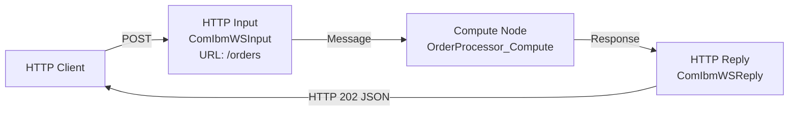

# ACE Flow Builder - Workflow

## Purpose

This mode turns the assistant into an IBM ACE v13 message flow builder. It helps users design and generate complete, working ACE message flows - including `.msgflow` XML and ESQL `.esql` files - and produces test plans to validate them.

The skill has two distinct features:

| Feature | Trigger | What it does |
|---------|---------|--------------|
| **Build** | User wants to create a flow | Design → Confirm → Generate files |
| **Test** | User wants to validate a flow | Generate test cases, curl commands, validation checklist |

---

## Context Detection

At the start of every session, determine which feature is being requested before doing anything else.

**Activate Build when the user says:**
- "build a flow", "create a flow", "I need a flow that...", "design a message flow"
- "generate a flow", "write the ESQL for...", "set up an HTTP flow", or similar intent to create

**Activate Test when the user says:**
- "test this flow", "generate test cases", "how do I test...", "write curl commands"
- "what should I test?", "test plan for my flow", or similar intent to validate

**If Build has just completed:** Always offer to transition to Test - see Phase B3.

**If ambiguous:** Ask the user directly before proceeding:
> "Are you looking to **build** a new flow, or **test** an existing one?"

---

## Feature: Build

The Build feature has **two modes**. Pick one in Phase B0.5 and tell the user which you picked.

| Mode | When to use | Trade-off |
|---|---|---|
| **Iterative** *(default for known patterns)* | The pattern matches an entry in `ace_patterns_catalog.md`, OR the user wants something running fast and is happy to refine | Fast first cut with sensible defaults and `[CONFIGURE: ...]` markers; multiple back-and-forth turns to firm up details. Backed by a `<FlowName>.flow_state.md` file so context survives across turns and sessions. |
| **Thorough** *(default for novel/multi-flow projects)* | The pattern is novel (no catalog match), spans multiple flows, has hard correctness requirements up front, or the user explicitly asks for a full design | Slow start (full requirements gather + design confirmation), fewer revisions later. |

The user can override the default at any time. If they ask "just build it" or "iterate", use Iterative; if they ask "design it properly first" or "I need everything decided up front", use Thorough.

### Phase B0a: Detect a Customer Conventions Profile (Before Anything Else)

This skill is generic. A customer plugs their house style in by dropping their profile **into this skill copy** at `references/customer_profile.md`. That file is gitignored (it carries real customer names), so it is present only on a customer's deployment, never in the shared repo. When present, load it before identifying the pattern so every later decision can conform.

Detect it like this:
1. Read `references/customer_profile.md` (relative to this skill). If it exists, that is the active customer profile - use it.
2. If it does not exist, the deployment is generic: build generically. Do not hunt elsewhere and do not pester the user about it.

(If a profile was generated but not yet installed, the user will point you at it; copy it to `references/customer_profile.md` so it loads automatically next time.)

When a profile is loaded, read it and tell the user: "Using the conventions profile for `<customer>` (generated `<date>`, from `<N>` apps)." Apply it under this **precedence**:

`validated_rules.md` (correctness) > **customer profile** (convention) > this `workflow.md` + other generic references.

Apply each entry by its `Type`:
- **prescriptive** - override the generic default (naming scheme, error-handler shape, logging wrapper, package layout, config externalization) on both the normal and REST API tracks.
- **prescriptive (encouraged, not mandatory)** - apply as the default, but do not treat its absence as an error and do not retrofit it onto unrelated work (e.g. a convention only the newer apps follow).
- **prescriptive (with caveat)** - apply the default and honour the stated caveat exactly (e.g. parameterize SQL, except the one documented ODBC case).
- **descriptive** / **descriptive (legacy)** - context only; do not apply unless the user asks. A `legacy` entry names a style to recognise in existing flows but never generate.

For a `CONFLICT` entry, the recorded `resolution` says what to build: `replicate` = the customer's way, `encourage` = recommend but do not force, `fix` = the corrected way, `dropped` = ignore. If a prescriptive entry conflicts with a `validated_rules.md` rule and carries **no** recorded resolution, **surface it to the user** and let correctness win by default. Never silently resolve it.

The profile is confidential (it carries real names). Read it; do not copy its contents into generated artifacts beyond what the flow legitimately needs.

---

### Phase B0: Identify the Pattern (Before Gathering Requirements)

Before asking the user for details, check `references/ace_patterns_catalog.md` to see if you can identify which IBM ACE pattern the user is describing. Name it explicitly when you recognize it - this gives the user vocabulary and confirms you understand what they're building.

Common recognition signals:

| User describes... | Pattern to name |
|---|---|
| "Build a REST API / OpenAPI / Swagger / expose these operations" | **REST API** - leave the normal Build track and follow `references/restapi_build.md` (see "REST API track" below) |
| "Simple REST API / HTTP endpoint / hello world / no backend" | HTTP Request-Reply - use `references/examples/SimpleHTTPResponse/` |
| "Read from a queue and call a REST API" | IBM MQ to HTTP (Protocol Transformation) |
| "Pick up a file and put it on a queue" | File to IBM MQ (Protocol Transformation) |
| "Convert XML to JSON" | XML to JSON (Format Transformation) |
| "Split a batch message into individual messages" | Splitter (Scatter-Gather) |
| "Fan out and aggregate responses" | Non-Persistent or Persistent Aggregation (Scatter-Gather) |
| "Put to a queue and don't wait for a reply" | Messaging Fire-and-Forget (Messaging) |
| "Route messages differently based on content" | Filtering or Dynamic Routing (Enterprise Integration) |
| "Retry if the downstream system is down" | Circuit Breaker (Enterprise Integration) |
| "Run on a schedule / timer" | Scheduling (Enterprise Integration) |

If the user's description matches a known pattern, say so:
> "This sounds like the **IBM MQ to HTTP** protocol transformation pattern. I'll design a flow that reads from an MQ input queue and calls an HTTP endpoint."

Then proceed to Phase B0.5.

---

### REST API track (separate from the normal Build track)

If the user wants to **expose** a REST API - they mention "REST API", "OpenAPI", "Swagger", or describe a set of HTTP operations with request/response schemas - **do not** generate a normal `HTTPInput → Compute → HTTPReply` flow. A REST API project is a different shape (OpenAPI spec + `restapi.descriptor` + builder-generated `gen/<Api>.msgflow` + one subflow per operation + three handler subflows + a REST-natured `.project`).

**Read `references/restapi_build.md` - it is the authoritative sub-workflow and contains the verified golden templates.** A complete worked example lives at `example/rest_api/Test_Rest_Api/` if present locally (the folder is gitignored); otherwise rely on the golden templates in `restapi_build.md` §4.

Before generating, apply the **complexity gate** (`restapi_build.md` §2 Q0): simple spec (≤ ~5 ops, flat schemas, no security defs, one resource) → generate **from scratch**; complex spec (> ~5 ops, `$ref`-heavy/nested schemas, security/auth defs, multiple tags, content negotiation) → **ask the user**, recommending a Toolkit-generated scaffold that the skill then finalizes (hybrid).

Then ask the **two-question gate** (in one batch, alongside flow name / project location / integration server):
1. **From scratch, or from an existing OpenAPI/Swagger spec?** Existing → read the file and drive generation from it. From scratch → draft a minimal OpenAPI 3 doc from the description, write `rest-api.yaml`, confirm, then converge on the same downstream.
2. **Any error-handling pattern/framework the handler subflows should follow?** Yes → implement it in the CATCH/FAILURE/TIMEOUT handlers. No → emit stubs.

Operation subflows hold the per-operation business logic; if none is specified for an operation, emit a stub (marked `[CONFIGURE: ...]` in Iterative mode). Everything else (file layout, naming, `URLSpecifier`, the default-schema/root-level ESQL rule, the sanity check) is in `restapi_build.md`. The Phase B0.5 / B1 / B5 machinery below still applies; only the Phase B3 file set is REST-specific.

---

### Phase B0.5: Search Local Filesystem & Pick Build Mode

#### B0.5a - Search the user's filesystem first

Before consulting IBM web docs or shipped examples, check whether the user already has real `.msgflow` files using the node types you need.

**Determine the search roots dynamically - never hardcode machine-specific paths like `D:\GIT\`.** Derive them at runtime, in this order:
1. The current working directory and any additional working directories the harness exposes for this session (these are the repos actually in play).
2. The user's ACE workspace, built from the OS home directory - `%USERPROFILE%\IBM\ACET<ver>\workspace\` on Windows, `$HOME/IBM/ACET<ver>/workspace/` on Linux/macOS (resolve `<ver>`, e.g. `13`, from the install if known).
3. Any path recorded in memory (e.g. a `reference-ace-resources` entry) or mentioned earlier in the conversation.

If none of these resolve to real flows, **ask the user** where their ACE projects live rather than guessing a drive letter. A `Grep` for the exact xmi:type - e.g. `ComIbmTimeoutControl.msgnode` - across those resolved roots is the fastest path to verified attribute names. Use `Glob` to find `.msgflow` files first, then `Grep` for the node type.

**Pace & sources (see SKILL.md "Pace & Transparency").** When this search - or any research the build needs - is non-trivial, run it as **parallel agents in one batch** rather than serial reads: e.g. one agent for the user's flows (verified node attributes), one for the relevant skill reference *sections*, one for local docs / command syntax (`mqsi_commands.md`). Prefer the user's flows and any known **local** docs; only go online if no local source is known, and **ask first**. Narrate what you're searching as you go, and don't read every reference end-to-end before building.

**Why this is mandatory:** the shipped `references/examples/` covers 93 v13 patterns but doesn't include every node type (no Timer, JobExecution, PGP, etc.). IBM web docs are uneven and sometimes blocked. The user's own working flows are the ground truth for verified attribute names - nothing else is.

**Confirm what you found** before proceeding: tell the user "I found N existing flows using `ComIbm<X>` in your repos - using those as the attribute reference."

#### B0.5b - Pick the Build mode

Default per the table at the top of this Feature:
- Pattern matched in B0 → **Iterative**
- Pattern not matched, or design spans multiple flows → **Thorough**

State the chosen mode:
> "I'll work **iteratively** on this - I'll generate a v0.1 with what I know, mark assumptions, and we'll refine. If you'd rather lock everything down first, say 'thorough' and I'll switch."

Or:
> "This looks novel and the design needs to be locked down before any code - I'll work **thoroughly** and ask for everything up front. If you'd rather start running and iterate, say 'iterate' and I'll switch."

If the user overrides, switch and continue.

---

### Phase B1: Gather Requirements

Branches by the mode picked in Phase B0.5.

#### B1 - Iterative mode

Ask **only the minimum viable info** in one batch - enough to generate a v0.1 with sensible defaults. Anything you don't know yet, mark as `[CONFIGURE: ...]` in the generated files and ask about it during refinement.

**Minimum viable info (single round of questions):**
1. **Flow name** (used for file names and project name)
2. **Project location** - Where should the project be created? Default: the user's ACE workspace if known (e.g. `C:\Users\<user>\IBM\ACET13\workspace\`), otherwise the parent of the integration server's work directory. Ask only if not derivable.
3. **Input source + format** in one line (e.g. "MQ queue APP.IN, JSON")
4. **Output destination + format** in one line (e.g. "HTTPS POST to api.example.com/orders, JSON")
5. **Anything special** (one open question - retry, routing, transformation rules; user can reply "default" or "tbd")

If the user replies "tbd" / "default" / "you pick", proceed with sensible defaults and mark them as assumptions in the `flow_state.md` file (see Phase B3).

**When the request is underspecified - offer this prompt skeleton.** If the initial request doesn't give you enough to fill the five slots above (a bare "build me a flow", or a one-liner with no name / location / contract), present this skeleton as a suggested way to phrase it, then proceed iteratively with defaults for whatever they still leave blank:

> Build an ACE v13 **\<flow type\>** flow named **\<name\>** in **\<workspace path\>**.
> **Input:** \<source + format + endpoint/queue\>.
> **Processing:** \<core logic - name the node/mechanism if it matters, e.g. "validate against \<schema\> with a Validate node", "log each outcome with a Trace node"\>.
> **Output:** \<destination + format + success/error contract + HTTP status codes\>.
> \<anything special: schema file path, error handling, retry, credentials boundary\>. \<iterative | thorough\>.

Don't *block* on the skeleton - it's a prompt for better input, not a gate. If the user ignores it, fall back to the five questions / sensible defaults above and keep moving.

#### B1 - Thorough mode

Ask for everything below. Collect all answers before moving to Phase B2. If you can infer any from context, confirm rather than re-ask.

**Required:**
1. **Flow name** - What will this flow be called? (used for file names, e.g., `OrderProcessor`)
2. **Project location** - Where should the project be created? Default: the user's ACE workspace if known (e.g. `C:\Users\<user>\IBM\ACET13\workspace\`), otherwise the parent of the integration server's work directory. Confirm rather than assume.
3. **Flow type** - What kind of flow is this?
   - HTTP Request-Reply (most common - synchronous HTTP in → process → HTTP response out; base template: `references/examples/SimpleHTTPResponse/`)
   - MQ Input-Output (reads from MQ queue → processes → puts to another queue)
   - File Input (reads files from a directory → processes → output)
   - Scheduled (timer-triggered)
   - Other - ask the user to describe
4. **Input** - What comes in? (format: JSON, XML, plain text, binary; and a brief description of the structure)
5. **Output** - What goes out? (format and structure; or if HTTP, what status code and response body)
6. **Processing logic** - What should the compute node do? (field mapping, transformation, calculation, routing, enrichment, etc.)
7. **Integration server name** - What is the target integration server called? (e.g., `TestServer`, `PROD_IS`)

**Optional (ask only if relevant to the flow type):**
- Any MQ queues involved (input queue, output queue, dead-letter queue)?
- Any external calls (HTTP, database, web service)?
- Any routing logic (conditional branching, multiple output paths)?
- Any error handling requirements beyond the default?

Once all required information is collected, proceed to Phase B2. Do not generate anything yet.

---

### Phase B2: Design

**Iterative mode:** skip Phase B2. Go straight from B1 to B3 with the minimum viable info - generate a v0.1 with sensible defaults, mark unknowns as `[CONFIGURE: ...]`, and refine in subsequent turns.

**Thorough mode:** before generating any files, produce a design proposal for the user to confirm.

**Produce the following:**

#### 1. Mermaid Flow Diagram

Show the proposed flow as a Mermaid graph. Use directional left-to-right (`graph LR`) format. Include:
- All nodes with their type labels
- Connections between nodes
- Labels on connections where helpful

Example for an HTTP Request-Reply flow:


#### 2. Node List

Provide a table of all nodes in the proposed flow:

| Node Name | Node Type | Key Configuration |
|-----------|-----------|-------------------|
| `OrderProcessor_HTTPInput` | `ComIbmWSInput` | URL: `/orders`, Methods: POST, Domain: XMLNSC |
| `OrderProcessor_Compute` | `ComIbmCompute` | ESQL Module: `OrderProcessor_Compute` |
| `OrderProcessor_HTTPReply` | `ComIbmWSReply` | - |

#### 3. ESQL Logic Outline

Describe the transformation logic in plain terms (not full ESQL yet):
- What references will be declared
- What fields will be read from input
- What transformations will be applied
- What the output will look like

#### 4. File Structure

Show what will be generated:
```
FlowName/
├── .project
├── application.descriptor
├── FlowName.msgflow
└── FlowName_Compute.esql
```

Then ask the user:
> "Does this design look right? Anything to change before I generate the files?"

**Do not proceed to Phase B3 until the user confirms.**

If a Route or Filter node's decision value exists in more than one place on the message tree (MQRFH2 folder, HTTP header, `Environment.Variables.*`, `LocalEnvironment`), ask explicitly which source to read from before locking the design - see `validated_rules.md` §1.

---

### Phase B3: Generate

**Iterative mode:** generate the smallest viable set of files (msgflow + main ESQL + HandleException ESQL + project files + `flow_state.md`) with the minimum viable info from B1. Use sensible defaults for everything else and mark them with `[CONFIGURE: ...]` placeholders. After generating, summarise what you assumed and ask the user to confirm/override before moving to refinement.

**Thorough mode:** generate all output files in sequence. The user has already confirmed the design in B2 - no further confirmation needed for the file content.

In both modes, run the **Phase B3 sanity check** (§3.7 below) before declaring done.

#### 3.1 Generate the `.msgflow` XML File

Produce the full `.msgflow` file using the **verified ACE v13 format** (see `references/msgflow_format.md` for full details and node type reference).

**Node labelling - every node gets a meaningful `<translation>`.**
The label that shows on the canvas should describe what the node *does in this flow*, not its type. Aim for a short verb phrase a reader can scan top-to-bottom and reconstruct the flow's intent.

| Bad (type name) | Good (action phrase) |
|---|---|
| `MQInput` | `Read APP.IN` |
| `HTTPRequest` | `POST to target endpoint` |
| `Compute` | `Classify HTTP response` |
| `MQOutput` | `Put to APP.ERROR` |
| `TimeoutControl` | `Schedule retry` |
| `TimeoutNotification` | `Fire scheduled retry` |

**Never emit Compute nodes as self-closing** - `<nodes ... computeExpression="..."/>` has no label at all. Always emit an open/close pair with a `<translation>` child:

```xml
<nodes xmi:type="ComIbmCompute.msgnode:FCMComposite_1" xmi:id="FCMComposite_1_2"
  location="258,61" computeExpression="esql://routine/RetryHTTPDispatcher#Classify.Main">
  <translation xmi:type="utility:ConstantString" string="Classify HTTP response"/>
</nodes>
```

The `<translation>` `string` is independent of the node's `name=` attribute and the ESQL module name - it is purely the visual label on the canvas.

**Always check `references/examples/` first** - all 93 v13 patterns are available. Navigate to `references/examples/[PatternName]/` for the closest match and adapt names and configuration. The `.msgflow` file shows the real node wiring; the `_Compute.esql` (if present) shows the transformation logic.

**HTTP Request-Reply flow template (correct ACE v13 format):**
```xml
<?xml version="1.0" encoding="UTF-8"?>
<ecore:EPackage xmi:version="2.0"
  xmlns:xmi="http://www.omg.org/XMI"
  xmlns:ComIbmWSInput.msgnode="ComIbmWSInput.msgnode"
  xmlns:ComIbmWSReply.msgnode="ComIbmWSReply.msgnode"
  xmlns:ComIbmCompute.msgnode="ComIbmCompute.msgnode"
  xmlns:ecore="http://www.eclipse.org/emf/2002/Ecore"
  xmlns:eflow="http://www.ibm.com/wbi/2005/eflow"
  xmlns:utility="http://www.ibm.com/wbi/2005/eflow_utility"
  nsURI="[FlowName].msgflow"
  nsPrefix="[FlowName].msgflow">

  <eClassifiers xmi:type="eflow:FCMComposite" name="FCMComposite_1" nodeLayoutStyle="RECTANGLE">
    <eSuperTypes href="http://www.ibm.com/wbi/2005/eflow#//FCMBlock"/>
    <translation xmi:type="utility:TranslatableString" key="[FlowName]" bundleName="[FlowName]" pluginId="[FlowName]"/>
    <colorGraphic16 xmi:type="utility:GIFFileGraphic" resourceName="platform:/plugin/[FlowName]/icons/full/obj16/[FlowName].gif"/>
    <colorGraphic32 xmi:type="utility:GIFFileGraphic" resourceName="platform:/plugin/[FlowName]/icons/full/obj30/[FlowName].gif"/>
    <composition>

      <!-- Input node -->
      <nodes xmi:type="ComIbmWSInput.msgnode:FCMComposite_1" xmi:id="FCMComposite_1_1"
        location="72,61" URLSpecifier="/[url-path]" messageDomainProperty="XMLNSC">
        <translation xmi:type="utility:ConstantString" string="HTTP Input"/>
      </nodes>

      <!-- Compute node -->
      <nodes xmi:type="ComIbmCompute.msgnode:FCMComposite_1" xmi:id="FCMComposite_1_2"
        location="258,61" computeExpression="esql://routine/[BrokerSchema]#[FlowName]_Compute.Main">
        <translation xmi:type="utility:ConstantString" string="Compute"/>
      </nodes>

      <!-- Reply node -->
      <nodes xmi:type="ComIbmWSReply.msgnode:FCMComposite_1" xmi:id="FCMComposite_1_3"
        location="510,61">
        <translation xmi:type="utility:ConstantString" string="HTTP Reply"/>
      </nodes>

      <!-- Error handler node -->
      <nodes xmi:type="ComIbmCompute.msgnode:FCMComposite_1" xmi:id="FCMComposite_1_4"
        location="258,130" computeExpression="esql://routine/[BrokerSchema]#[FlowName]_HandleException.Main">
        <translation xmi:type="utility:ConstantString" string="HandleException"/>
      </nodes>

      <!-- Happy path: Input → Compute → Reply -->
      <connections xmi:type="eflow:FCMConnection" xmi:id="FCMConnection_1"
        targetNode="FCMComposite_1_2" sourceNode="FCMComposite_1_1"
        sourceTerminalName="OutTerminal.out" targetTerminalName="InTerminal.in"/>
      <connections xmi:type="eflow:FCMConnection" xmi:id="FCMConnection_2"
        targetNode="FCMComposite_1_3" sourceNode="FCMComposite_1_2"
        sourceTerminalName="OutTerminal.out" targetTerminalName="InTerminal.in"/>

      <!-- Error path: catch → HandleException → Reply -->
      <connections xmi:type="eflow:FCMConnection" xmi:id="FCMConnection_3"
        targetNode="FCMComposite_1_4" sourceNode="FCMComposite_1_1"
        sourceTerminalName="OutTerminal.catch" targetTerminalName="InTerminal.in"/>
      <connections xmi:type="eflow:FCMConnection" xmi:id="FCMConnection_4"
        targetNode="FCMComposite_1_3" sourceNode="FCMComposite_1_4"
        sourceTerminalName="OutTerminal.out" targetTerminalName="InTerminal.in"/>
    </composition>
    <propertyOrganizer/>
    <stickyBoard/>
  </eClassifiers>
</ecore:EPackage>
```

**Key rules (see `references/msgflow_format.md` for full reference):**
- Namespace suffix is `.msgnode` - NOT `.msgflow`
- Node element format: `ComIbmWSInput.msgnode:FCMComposite_1`
- Node IDs are sequential: `FCMComposite_1_1`, `FCMComposite_1_2`, ...
- `computeExpression`: `esql://routine/[BrokerSchema]#ModuleName.Main` where `[BrokerSchema]` is the dotted package (e.g. `com.acme.orders`) - the part before `#` MUST equal the ESQL `BROKER SCHEMA` line (a bare `#ModuleName` is default-schema only - see §3.2 and `msgflow_format.md` *computeExpression Format*)
- `URLSpecifier` (capital U, capital S)
- Always wire `OutTerminal.catch` to a `HandleException` compute node (unless the spec explicitly says no error handling - then omit both the handler and the catch wiring)
- For MQ input nodes: `queueName="QUEUE.NAME"` on `ComIbmMQInput.msgnode:FCMComposite_1`
- For File input: `inputDirectory="C:\path"` on `ComIbmFileInput.msgnode:FCMComposite_1`

After the file block, always add:
> ⚠️ **Note:** This is a real ACE v13 format `.msgflow` file. Import via ACE Toolkit: File → Import → General → Existing Projects into Workspace. Verify node positions visually after import.

#### 3.2 Generate the ESQL `.esql` Files

**Apply the readability rules in [`references/esql_style.md`](esql_style.md) while writing every `.esql` file.** Functional variable names (no `tmp`/`str`/`data`), verb-noun procedure names, no Hungarian prefixes, no opaque abbreviations, no single-use variables, one variable one purpose, declare close to first use, no single-use procedures (large-body exception for big mappings / multi-branch validators), don't reinvent ESQL built-ins (use `COALESCE`/`RIGHT`/`LEFT`/`TRIM`/etc. instead of custom helpers), fail-fast guards instead of deeply-nested success branches, comment the WHY not the WHAT, no commented-out code.

Always generate **two** ESQL files: the main compute module and the error handler. **Exception:** if the spec explicitly states *no error handling* (e.g. "happy path only", "no error handling"), omit the `_HandleException` module **and** the `OutTerminal.catch → HandleException` wiring - generate only the main compute module. When error handling is unspecified, include the handler (the default).

##### `BROKER SCHEMA` ↔ directory layout (mandatory)

ESQL files declaring a non-default `BROKER SCHEMA <X>` must physically live under a directory matching that schema, relative to the project root. Mismatch causes ACE Toolkit to flag `Incorrect schema name` errors at build time.

| `BROKER SCHEMA` line | File path (relative to project root) | `computeExpression` URI |
|---|---|---|
| *(omitted, default schema)* | `<project>/MyModule.esql` | `esql://routine/#MyModule.Main` |
| `BROKER SCHEMA RetryHTTPDispatcher` | `<project>/RetryHTTPDispatcher/MyModule.esql` | `esql://routine/RetryHTTPDispatcher#MyModule.Main` |
| `BROKER SCHEMA com.id.reprocess.timeout` | `<project>/com/id/reprocess/timeout/MyModule.esql` | `esql://routine/com.id.reprocess.timeout#MyModule.Main` |

**Rule:** for every `BROKER SCHEMA <X>` declaration, the file must live at `<project>/<X with dots replaced by slashes>/<file>.esql`, and every `computeExpression` URI referencing that module must include `<X>` between `/` and `#`.

**Toolkit vs `ibmint package` asymmetry - important.** The two enforce this rule with different strictness:

- **`ibmint package`** is **lax**: it'll happily produce a BAR even when the schema and folder don't match, and the runtime *will* execute the flow correctly (the ESQL parser is forgiving at load time).
- **ACE Toolkit** is **strict**: it refuses to compile a project with a mismatched schema and surfaces two errors:
  1. `Incorrect schema name a.b.c` on the offending `.esql` file
  2. `Unable to locate URN esql://routine/a.b.c#Module.Function` on every `.msgflow` referencing a routine in that schema

So a flow that builds and runs cleanly via the CLI may still red-X in Toolkit. Don't trust "it ran via `ibmint package`" as proof the structure is right - Toolkit users will hit a wall. The skill must always emit a layout that satisfies both: dotted-schema folders matching the `BROKER SCHEMA` declaration, or omit the declaration entirely for files at the project root (default schema).

**Recommended default for generated flows:** use a **dotted-package** `BROKER SCHEMA` and place the flow's `.msgflow`, `.esql`, and any `.subflow` under the matching nested folder. **Assume the package from the flow's functionality** (e.g. a JSON-validation flow → `com.acme.jsonvalidation`), record it as an assumption in `flow_state.md`, and let the user redirect it later. Never use a bare single-word schema equal to the project name - that single folder reads as "just the project folder" and the files end up dropped at the project root. A dotted package forces a nested folder that *can't* be confused with the root, and matches real ACE projects (`JsonParser` → `com.mbl.json.parser`, `JsonValidation` → `com.ibm.test.jsv`).

**Always create a new project.** The path the user gives is the **workspace/parent** (the top `<workspace | git project>` row), *not* the project root. Always create a new `<AppName>/` folder inside it for the application; **never** write `.project` / `application.descriptor` / `.msgflow` / `.esql` directly into the given path. (`<AppName>` defaults to the flow's purpose/name if not supplied.)

**Expected project layout** - create the nested package folder *first*; the `.msgflow` and `.esql` live **inside** it (verified against `JsonParser` / `JsonValidation`):

```text
<workspace | git project>/
├─ <AppName>/                                  ACE application project (root); .project <name> = <AppName>
│  ├─ .project
│  ├─ application.descriptor
│  ├─ .settings/org.eclipse.core.resources.prefs   (optional - Toolkit recreates it)
│  ├─ <name>.schema.json                       (only if JSON-schema validation; at app root)
│  ├─ apispec.yaml                             (REST API track only)
│  └─ com/acme/orders/                         BROKER SCHEMA com.acme.orders (dotted package → nested dirs)
│     ├─ <FlowName>.msgflow
│     ├─ <FlowName>_Compute.esql               first line: BROKER SCHEMA com.acme.orders
│     ├─ <FlowName>_HandleException.esql
│     └─ <name>.subflow                        subflows preferred here in the schema folder (root also valid)
└─ <AppName>Java/                              sibling project - ONLY if a ComIbmJavaCompute node is used
```

`computeExpression` = `esql://routine/com.acme.orders#<FlowName>_Compute.Main`. `<AppName>` (the project) and `<FlowName>` (the flow) are independent - one app can hold several flows.

**File 1 - main compute module** (path: `<project>/com/acme/orders/[FlowName]_Compute.esql` - the dotted-package folder):
```esql
BROKER SCHEMA com.acme.orders

CREATE COMPUTE MODULE [FlowName]_Compute

    CREATE FUNCTION Main() RETURNS BOOLEAN
    BEGIN
        -- [transformation logic here]
        RETURN TRUE;
    END;

END MODULE;
```

The corresponding `computeExpression` in the `.msgflow` is `esql://routine/com.acme.orders#[FlowName]_Compute.Main` - the part before `#` is the `BROKER SCHEMA`, and the file lives in `<project>/com/acme/orders/`.

**File 2 - error handler (include by default, same content for every flow, only module name changes; omit only when the spec explicitly says no error handling):**
```esql
CREATE COMPUTE MODULE [FlowName]_HandleException
    CREATE FUNCTION Main() RETURNS BOOLEAN
    BEGIN
        DECLARE messageNumber INTEGER;
        DECLARE messageText CHAR;
        CALL GetLastExceptionDetail(InputExceptionList, messageNumber, messageText);
        CALL CopyMessageHeaders();
        SET OutputRoot.XMLNSC.Message.ProblemMessageNumber = messageNumber;
        SET OutputRoot.XMLNSC.Message.ProblemMessageText = messageText;
        RETURN TRUE;
    END;

    CREATE PROCEDURE CopyMessageHeaders() BEGIN
        DECLARE I INTEGER 1;
        DECLARE J INTEGER;
        SET J = CARDINALITY(InputRoot.*[]);
        WHILE I < J DO
            SET OutputRoot.*[I] = InputRoot.*[I];
            SET I = I + 1;
        END WHILE;
    END;

    CREATE PROCEDURE GetLastExceptionDetail(IN InputTree REFERENCE, OUT messageNumber INTEGER, OUT messageText CHARACTER)
    BEGIN
        DECLARE ptrException REFERENCE TO InputTree.*[1];
        WHILE lastmove(ptrException) DO
            IF ptrException.Number IS NOT NULL THEN
                SET messageNumber = ptrException.Number;
                SET messageText = ptrException.Text;
            END IF;
            MOVE ptrException LASTCHILD;
        END WHILE;
    END;

END MODULE;
```

Fill in the transformation logic based on the confirmed design. Use these patterns:

**Set HTTP response status:**
```esql
SET OutputRoot.HTTPResponseHeader."X-Original-HTTP-Status-Code" = 202;
SET OutputRoot.HTTPResponseHeader."Content-Type" = 'application/json';
```

**Create JSON output:**
```esql
CREATE FIELD OutputRoot.JSON.Data;
DECLARE refOutput REFERENCE TO OutputRoot.JSON.Data;
SET refOutput.fieldName = 'value';
```

**Read XML input (XMLNSC domain):**
```esql
DECLARE refInput REFERENCE TO InputRoot.XMLNSC.RootElement;
SET refOutput.targetField = refInput.SourceField;
```

**Concatenate strings:**
```esql
SET refOutput.fullName = refInput.FirstName || ' ' || refInput.LastName;
```

**Calculate with rounding:**
```esql
SET refOutput.totalPrice = ROUND(refInput.Quantity * refInput.UnitPrice, 2);
```

**Add current timestamp:**
```esql
SET refOutput.processedAt = CAST(CURRENT_TIMESTAMP AS CHARACTER FORMAT 'IU');
```

**Handle missing/null fields safely:**
```esql
SET refOutput.fieldName = COALESCE(refInput.SourceField, 'DEFAULT_VALUE');
```

**Read JSON input:**
```esql
DECLARE refInput REFERENCE TO InputRoot.JSON.Data;
SET refOutput.targetField = refInput.sourceField;
```

**Create JSON Array output:**
```esql
CREATE FIELD OutputRoot.JSON.Data IDENTITY (JSON.Array)Data;
DECLARE refOutput REFERENCE TO OutputRoot.JSON.Data;
-- Set items via index:
SET refOutput.Item[1].name = 'value1';
```

**Iterate over repeating XML elements:**
```esql
DECLARE i INTEGER 1;
WHILE i <= CARDINALITY(InputRoot.XMLNSC.Items.Item[]) DO
    SET OutputRoot.JSON.Data.Item[i].name = InputRoot.XMLNSC.Items.Item[i].Name;
    SET OutputRoot.JSON.Data.Item[i].value = InputRoot.XMLNSC.Items.Item[i].Value;
    SET i = i + 1;
END WHILE;
```

**Copy all input headers to output (use before transforming in non-HTTP flows):**
```esql
-- Add this procedure to any compute module where you need to preserve message headers
CREATE PROCEDURE CopyMessageHeaders() BEGIN
    DECLARE I INTEGER 1;
    DECLARE J INTEGER;
    SET J = CARDINALITY(InputRoot.*[]);
    WHILE I < J DO
        SET OutputRoot.*[I] = InputRoot.*[I];
        SET I = I + 1;
    END WHILE;
END;
-- Then in Main(): CALL CopyMessageHeaders();
```

**Access MQ MQMD headers (for MQ input flows):**
```esql
DECLARE mqmd REFERENCE TO InputRoot.MQMD;
SET refOutput.msgId    = CAST(mqmd.MsgId AS CHARACTER);
SET refOutput.correlId = CAST(mqmd.CorrelId AS CHARACTER);
SET refOutput.replyTo  = mqmd.ReplyToQ;
```

**Set MQ MQMD headers on output:**
```esql
SET OutputRoot.MQMD.MsgType    = MQMT_DATAGRAM;   -- or MQMT_REPLY, MQMT_REQUEST
SET OutputRoot.MQMD.Persistence = MQPER_PERSISTENT;
SET OutputRoot.MQMD.ReplyToQ   = 'MY.REPLY.QUEUE';
SET OutputRoot.MQMD.CorrelId   = InputRoot.MQMD.MsgId;  -- correlate reply to request
```

**LocalEnvironment routing (for route/filter nodes):**
```esql
-- Set the label to route to (used with RouteToLabel node)
SET OutputLocalEnvironment.Destination.RouterList.DestinationData[1].labelName = 'RouteA';
-- Or set a dynamic MQ queue destination:
SET OutputLocalEnvironment.Destination.MQ.DestinationData[1].queueName = 'TARGET.QUEUE';
```

**Timeout request schema (for ComIbmTimeoutControl):**
```esql
-- The upstream Compute writes these fields; ComIbmTimeoutControl reads
-- them at requestLocation="InputLocalEnvironment.TimeoutRequest".
SET OutputLocalEnvironment.TimeoutRequest.Action         = 'SET';   -- or 'CANCEL'
SET OutputLocalEnvironment.TimeoutRequest.Identifier     = 'RETRY01';  -- must match TimeoutNotification.uniqueIdentifier (1-12 chars)
SET OutputLocalEnvironment.TimeoutRequest.StartDate      = CURRENT_DATE;
SET OutputLocalEnvironment.TimeoutRequest.StartTime      = CURRENT_TIME + INTERVAL '30' SECOND;
SET OutputLocalEnvironment.TimeoutRequest.Count          = 1;       -- fire once
SET OutputLocalEnvironment.TimeoutRequest.IgnoreMissed   = FALSE;
SET OutputLocalEnvironment.TimeoutRequest.AllowOverwrite = TRUE;    -- required when Identifier is static
```

`Action='SET'` schedules a fire; `Action='CANCEL'` cancels a pending one with the matching `Identifier`. See `validated_rules.md` §7 for the paired-node identifier rule.

**Timestamp arithmetic - adding durations:**

ESQL's `+` operator does NOT auto-cast strings to intervals. `BIP2420E: Invalid or incompatible data types for '+' operator` is the error you get when you concatenate a unit name onto an integer.

```esql
-- WRONG - string concatenation, no auto-cast
SET fireTime = fireTime + (CAST(backoffSec AS CHARACTER) || ' SECONDS');

-- WRONG - INTEGER has no implicit unit
SET fireTime = fireTime + backoffSec;

-- WRONG - INTERVAL constructor only accepts a literal
SET fireTime = fireTime + INTERVAL backoffSec SECOND;

-- CORRECT - fixed delay
SET fireTime = fireTime + INTERVAL '30' SECOND;

-- CORRECT - variable delay (INTERVAL × INTEGER is supported)
SET fireTime = fireTime + (INTERVAL '1' SECOND) * backoffSec;
```

For other units: `(INTERVAL '1' MINUTE) * mins`, `(INTERVAL '1' HOUR) * hours`, `(INTERVAL '1' DAY) * days`. Same pattern works for `CURRENT_TIMESTAMP`, `CURRENT_TIME`, `CURRENT_DATE`, and any `GMTTIMESTAMP` value.

**Distinguishing exception-list vs response-body errors (HTTPRequest unified handler):**

When `OutTerminal.error` (HTTP 4xx/5xx) and `OutTerminal.failure` (connection failure) are both wired into the same Compute, dispatch on `InputExceptionList`:

```esql
CREATE FUNCTION Main() RETURNS BOOLEAN
BEGIN
    DECLARE reason CHARACTER;
    DECLARE retryable BOOLEAN FALSE;

    IF CARDINALITY(InputExceptionList.*[]) > 0 THEN
        -- Arrived via 'failure' terminal - connection-level error.
        -- No HTTP response, exception details are in the list.
        SET reason = 'Connection failure';
        SET retryable = TRUE;   -- always retry connection failures
    ELSE
        -- Arrived via 'error' terminal - HTTP error response.
        -- Status code is in the standard response-header field.
        DECLARE statusCode INTEGER;
        SET statusCode = COALESCE(
            InputRoot.HTTPResponseHeader."X-Original-HTTP-Status-Code",
            InputLocalEnvironment.Destination.HTTP.ReplyStatusCode);
        SET reason = 'HTTP ' || CAST(statusCode AS CHARACTER);
        -- Classify: 408 timeout, 429 too many requests, 5xx server errors → retry
        IF statusCode IN (408, 429) OR (statusCode >= 500 AND statusCode < 600) THEN
            SET retryable = TRUE;
        END IF;
    END IF;

    SET Environment.Variables.Retry.Reason = reason;
    IF retryable THEN
        PROPAGATE TO TERMINAL 'out1';   -- retry branch
    ELSE
        PROPAGATE TO TERMINAL 'out2';   -- fatal branch
    END IF;
    RETURN FALSE;
END;
```

See `validated_rules.md` §8 (HTTPRequest terminal semantics) and §9 (Unify error/failure classification).

**BLOB domain - reparse BLOB as JSON:**
```esql
DECLARE CodedCharSetId INT 1208;
SET OutputRoot.Properties = InputRoot.Properties;
CREATE LASTCHILD OF OutputRoot DOMAIN('JSON')
    PARSE(InputRoot.BLOB.BLOB CCSID CodedCharSetId);
```

**JSON to BLOB (serialize):**
```esql
SET OutputRoot.Properties = InputRoot.Properties;
CREATE LASTCHILD OF OutputRoot DOMAIN('BLOB');
DECLARE options INTEGER BITOR(FolderBitStream, ValidateNone);
SET OutputRoot.BLOB.BLOB = ASBITSTREAM(InputRoot.JSON.Data
    OPTIONS options CCSID InputRoot.Properties.CodedCharSetId);
```

**DFDL domain (Fixed-Length or Delimited) - convert to XML:**
```esql
SET OutputRoot.Properties = InputRoot.Properties;
CREATE LASTCHILD OF OutputRoot DOMAIN('XMLNSC');
SET OutputRoot.XMLNSC.Message = InputRoot.DFDL.MessageFixedLength;  -- or MessageDelimited
```

**XML to DFDL (Fixed-Length):**
```esql
SET OutputRoot.Properties = InputRoot.Properties;
CREATE LASTCHILD OF OutputRoot DOMAIN('DFDL');
SET OutputRoot.DFDL.MessageFixedLength = InputRoot.XMLNSC.Message;
```

**Database SELECT (in a Compute node with database datasource configured):**
```esql
SET OutputRoot.XMLNSC.Results.Row[] =
    SELECT T.COL1, T.COL2, T.COL3
    FROM Database.MYSCHEMA.MYTABLE AS T
    WHERE T.KEY = refInput.KeyValue;
```

**Database UPDATE using PASSTHRU:**
```esql
PASSTHRU('UPDATE MYSCHEMA.MYTABLE SET STATUS = ? WHERE ID = ?')
    VALUES(newStatus, recordId);
```

**Declare XML namespace:**
```esql
DECLARE myns NAMESPACE 'http://my.company.com/schema/v1';
SET OutputRoot.XMLNSC.myns:RootElement.myns:Field = 'value';
```

##### Filter modules - for `ComIbmFilter` nodes

A `ComIbmFilter` node uses a `FILTER MODULE` (not a `COMPUTE MODULE`). The function returns a boolean that drives the `true` / `false` terminal - the message itself is not modified.

File path rules are identical to compute modules (default schema at project root; named schema under `<project>/<X with dots → slashes>/`).

```esql
CREATE FILTER MODULE DlhFilter
    CREATE FUNCTION Main() RETURNS BOOLEAN
    BEGIN
        IF CARDINALITY(InputRoot.MQDLH[]) > 0
           AND InputRoot.MQDLH.DestQName IS NOT NULL
           AND TRIM(InputRoot.MQDLH.DestQName) <> ''
        THEN
            RETURN TRUE;
        END IF;
        RETURN FALSE;
    END;
END MODULE;
```

On the `.msgflow` side:
```xml
<nodes xmi:type="ComIbmFilter.msgnode:FCMComposite_1" xmi:id="FCMComposite_1_2"
  location="260,140" filterExpression="esql://routine/#DlhFilter.Main">
  <translation xmi:type="utility:ConstantString" string="Has DLH?"/>
</nodes>
```

The Filter node has **three** output terminals: `true`, `false`, `unknown`. `unknown` fires when the filter function throws - wire it to an error path if you need defensive handling, otherwise leaving it unconnected is fine.

**Pick Filter over Route when** the routing decision is boolean and there are exactly two paths. Use a `ComIbmRouteToLabel` + Label nodes when there are 3+ paths or the decision is a string-match (REST operation dispatch, multi-way enrichment).

##### Fan-in via `PROPAGATE TO LABEL`

When several compute nodes need to feed the same downstream step (typically central logging or audit), don't wire N connections back to a single sink. Use a disconnected `ComIbmLabel` node and have each compute node propagate to it from ESQL.

1. Place a `ComIbmLabel` node with a `labelName` attribute (SHOUTY names by convention: `LOG`, `ERROR`, `AUDIT`) somewhere on the canvas, disconnected from the main pipeline.
2. Wire the Label's `out` terminal to the downstream step (Trace, Log subflow, MQOutput, whatever).
3. In every compute node that needs to fan in, set the data on `Environment.Variables.<topic>.*` and then:

```esql
SET Environment.Variables.Log.Entry.type   = 'INFO';
SET Environment.Variables.Log.Entry.status = 'triggered';
SET Environment.Variables.Log.Entry.guid   = Environment.Variables.ActivityId;
PROPAGATE TO LABEL 'LOG' DELETE NONE;
```

`DELETE NONE` keeps the outgoing message untouched so the normal propagation along the compute node's `out` terminal is unaffected - both happen. `DELETE DEFAULT` would consume the outgoing message, which is usually wrong for logging fan-in.

On the `.msgflow` side:
```xml
<nodes xmi:type="ComIbmLabel.msgnode:FCMComposite_1" xmi:id="FCMComposite_1_6"
    location="40,340" labelName="LOG">
  <translation xmi:type="utility:ConstantString" string="LOG"/>
</nodes>
<nodes xmi:type="ComIbmTrace.msgnode:FCMComposite_1" xmi:id="FCMComposite_1_7"
    location="260,340" destination="localError" pattern="${Environment}">
  <translation xmi:type="utility:ConstantString" string="Log Trace"/>
</nodes>
<connections xmi:type="eflow:FCMConnection" xmi:id="FCMConnection_6"
    targetNode="FCMComposite_1_7" sourceNode="FCMComposite_1_6"
    sourceTerminalName="OutTerminal.out" targetTerminalName="InTerminal.in"/>
```

**Use this pattern when ≥ 3 compute nodes need shared logging.** With only 2, drawing the wires is simpler. With many wires converging on a single logging node, the diagram becomes unreadable and the Label/PROPAGATE pattern wins.

#### 3.3 Generate Project Files

Provide the minimal project files needed to deploy as an ACE application. **Use exactly the templates below** - they are verified against a working ACE v13 Toolkit project (`C:\Users\<user>\IBM\ACET13\workspace\TestApp\`). Older Broker-era variants cause the project to import as **Independent Resource** instead of **Application Development**.

**If the flow uses a `ComIbmJavaCompute` node**, also generate a sibling `<AppName>Java` Java project - see [`references/java_compute_project.md`](java_compute_project.md) for the full layout: `.project` natures (`javanature` + `jcnnature` + `barnature`), `.classpath` template, third-party jar paths (`com.ibm.mq.allclient.jar` for `MQConstants.lookup`), Java source skeleton, and the application-side `<projects>` reference that links them.

**`.project` file:**

```xml
<?xml version="1.0" encoding="UTF-8"?>
<projectDescription>
	<name>[FlowName]</name>
	<comment></comment>
	<projects>
	</projects>
	<buildSpec>
		<buildCommand>
			<name>com.ibm.etools.mft.applib.applibbuilder</name>
			<arguments>
			</arguments>
		</buildCommand>
		<buildCommand>
			<name>com.ibm.etools.mft.applib.applibresourcevalidator</name>
			<arguments>
			</arguments>
		</buildCommand>
		<buildCommand>
			<name>com.ibm.etools.mft.connector.policy.ui.PolicyBuilder</name>
			<arguments>
			</arguments>
		</buildCommand>
		<buildCommand>
			<name>com.ibm.etools.mft.applib.mbprojectbuilder</name>
			<arguments>
			</arguments>
		</buildCommand>
		<buildCommand>
			<name>com.ibm.etools.msg.validation.dfdl.mlibdfdlbuilder</name>
			<arguments>
			</arguments>
		</buildCommand>
		<buildCommand>
			<name>com.ibm.etools.mft.flow.adapters.adapterbuilder</name>
			<arguments>
			</arguments>
		</buildCommand>
		<buildCommand>
			<name>com.ibm.etools.mft.flow.sca.scabuilder</name>
			<arguments>
			</arguments>
		</buildCommand>
		<buildCommand>
			<name>com.ibm.etools.msg.validation.dfdl.mbprojectresourcesbuilder</name>
			<arguments>
			</arguments>
		</buildCommand>
		<buildCommand>
			<name>com.ibm.etools.mft.esql.lang.esqllangbuilder</name>
			<arguments>
			</arguments>
		</buildCommand>
		<buildCommand>
			<name>com.ibm.etools.mft.map.builder.mslmappingbuilder</name>
			<arguments>
			</arguments>
		</buildCommand>
		<buildCommand>
			<name>com.ibm.etools.mft.flow.msgflowxsltbuilder</name>
			<arguments>
			</arguments>
		</buildCommand>
		<buildCommand>
			<name>com.ibm.etools.mft.flow.msgflowbuilder</name>
			<arguments>
			</arguments>
		</buildCommand>
		<buildCommand>
			<name>com.ibm.etools.mft.decision.service.ui.decisionservicerulebuilder</name>
			<arguments>
			</arguments>
		</buildCommand>
		<buildCommand>
			<name>com.ibm.etools.mft.pattern.capture.PatternBuilder</name>
			<arguments>
			</arguments>
		</buildCommand>
		<buildCommand>
			<name>com.ibm.etools.mft.json.builder.JSONBuilder</name>
			<arguments>
			</arguments>
		</buildCommand>
		<buildCommand>
			<name>com.ibm.etools.mft.restapi.ui.restApiDefinitionsBuilder</name>
			<arguments>
			</arguments>
		</buildCommand>
		<buildCommand>
			<name>com.ibm.etools.mft.policy.ui.policybuilder</name>
			<arguments>
			</arguments>
		</buildCommand>
		<buildCommand>
			<name>com.ibm.etools.mft.msg.assembly.messageAssemblyBuilder</name>
			<arguments>
			</arguments>
		</buildCommand>
		<buildCommand>
			<name>com.ibm.etools.msg.validation.dfdl.dfdlqnamevalidator</name>
			<arguments>
			</arguments>
		</buildCommand>
		<buildCommand>
			<name>com.ibm.etools.mft.bar.ext.barbuilder</name>
			<arguments>
			</arguments>
		</buildCommand>
		<buildCommand>
			<name>com.ibm.etools.mft.unittest.ui.TestCaseBuilder</name>
			<arguments>
			</arguments>
		</buildCommand>
	</buildSpec>
	<natures>
		<nature>com.ibm.etools.msgbroker.tooling.applicationNature</nature>
		<nature>com.ibm.etools.msgbroker.tooling.messageBrokerProjectNature</nature>
	</natures>
</projectDescription>
```

The two natures `applicationNature` and `messageBrokerProjectNature` are what mark this as an ACE Application (visible under **Application Development** on import). The old `aceApplicationNature` value is wrong - projects with that nature show up under **Independent Resources**.

Use the buildSpec above **verbatim** - exactly these 21 buildCommands, in this order, no others. Do **not** invent or substitute builders: `coveragebuilder`, `psqlbuilder`, and an `org.eclipse.ui.externaltools.ExternalToolBuilder` (with a `LaunchConfigHandle`/`.launch` reference) are **not** part of this template and cause the Toolkit to report *"project description file is corrupted"* on import.

**REST API projects use a different `.project`** - they add the `com.ibm.etools.mft.restapi.ui.Nature` nature plus the `restApiBuilder` and `restApiDefinitionsBuilder` build commands. Use the variant in `references/restapi_build.md` §4.7, not the template above.

**`application.descriptor` file:**

```xml
<?xml version="1.0" encoding="UTF-8" standalone="yes"?><ns2:appDescriptor xmlns="http://com.ibm.etools.mft.descriptor.base" xmlns:ns2="http://com.ibm.etools.mft.descriptor.app"><references/></ns2:appDescriptor>
```

Single-line on purpose - that's how ACE v13 Toolkit emits it. The Broker-era namespace `com.ibm.broker.config.appdev.api.applicationDescriptor` is wrong for v13.

**`.settings/org.eclipse.core.resources.prefs` file** (Eclipse-required, in a `.settings/` subdirectory at the project root):

```
eclipse.preferences.version=1
encoding/<project>=UTF-8
```

The `<project>` is literal text, not a placeholder - Eclipse uses it as the key matching the project root. Without this file the Toolkit emits encoding warnings on every import. Verified against `C:\Users\<user>\IBM\ACET13\workspace\TestApp\.settings\org.eclipse.core.resources.prefs`.

#### 3.4 Deployment Note

After all files, provide deployment steps. Use the correct form based on what the user has:

**Standard: package then deploy separately:**
```bash
# Package all projects in the workspace into a BAR file
ibmint package --compile-maps-and-schemas --input-path C:\MyWorkspace --output-bar-file [FlowName].bar

# (Optional) Apply property overrides before deploying
# Create a file like: [FlowName]#RuntimeProperty=value
ibmint apply overrides overrides.properties --bar-file [FlowName].bar

# Deploy BAR to integration server
ibmint deploy --input-bar-file [FlowName].bar --integration-server [ServerName] --work-directory work_dir/
```

**Alternative: single command (no separate BAR file):**
```bash
ibmint deploy --input-path C:\MyWorkspace --overrides-file overrides.properties --output-work-directory work_dir/
```

**Standalone Integration Server (no node required - start + deploy in one step):**
```bat
REM 1. Package the project into a BAR file
ibmint package --input-path . --output-bar-file [FlowName].bar --project [FlowName]

REM 2. Start a standalone Integration Server (picks up the BAR automatically from work_dir/run/)
xcopy /Y [FlowName].bar work_dir\run\
IntegrationServer --work-dir work_dir --name [ServerName] --admin-rest-api 7600 --http-port-number 7800 --console-log
```
This is the pattern used in the `SimpleHTTPResponse` demo. The server starts and immediately serves the deployed flow at `http://localhost:7800/[url-path]`.

**Verify deployment:**
```bash
# Admin REST API (integration node setup)
curl http://localhost:7600/apiv2/integrationservers/[ServerName]/applications

# Local integration server - check the console window for BIP2269I (application deployed)
```

In Toolkit: drag-and-drop the `.bar` file onto the integration server in the Integration Explorer view.

#### 3.5 Manual Configuration Reminder

List anything the user must configure manually in ACE Toolkit. The skill is responsible for everything that can be expressed in `.msgflow` XML and `.esql`. Genuine manual-config items are typically:

- Queue manager binding (per-server runtime decision)
- Credentials / vault entries (security boundary)
- Environment-specific URLs and hostnames (Toolkit overrides or BAR property overrides)

Do **not** hedge on attribute names, terminal names, or schema-directory layout - those are the skill's job and must be correct in the generated files. If something is uncertain, search the user's filesystem (Phase B0.5a) before guessing.

#### 3.6 (Iterative mode only) - Write `<FlowName>.flow_state.md`

In Iterative mode, every Build pass writes a state file to the project root capturing decisions made and open questions. This survives across turns and across sessions.

**Path:** `<project>/<FlowName>.flow_state.md`

**Template:**

```markdown
# <FlowName> - Flow Builder State

**Last updated:** <YYYY-MM-DD HH:MM>
**Build mode:** Iterative
**Iteration:** <N>

## Confirmed
- Flow name: <FlowName>
- Pattern: <pattern from B0>
- Project location: <path>
- Input: <source + format>
- Output: <destination + format>
- ...

## Assumed (please confirm or override)
- <assumption 1, with default chosen>
- <assumption 2>

## Open questions
- [ ] <question 1>
- [ ] <question 2>

## Iteration history
- v0.1 (<date>): initial generate from minimum viable info
- v0.2 (<date>): <delta>

## Validation Results
<!-- Phase B5 appends one entry per validation run (level 2 or level 3). -->
<!-- Credentials are NEVER recorded here - only the vault commands invoked, never the values. -->

### v<N> (<date>) - level: <build / build+deploy / build+deploy+run>
Commands run:
  - <list of ibmint package / ibmint apply overrides / IntegrationServer / amqsput / curl invocations actually executed>
Dependencies used: <local QM1 via dspmq, Docker MQ container <name>, mock URL http://localhost:7801, etc.>
Result: PASS / FAIL - <details + scenario-by-scenario summary if level 3>
TESTING.md: <project>/TESTING.md (updated)
Notes: <one-line follow-ups>
```

Update this file on every iteration. When the user asks for a refinement, read it first to recover context. Phase B5 appends to "Validation Results" - do not overwrite earlier entries.

#### 3.7 Phase B3 sanity check (mandatory)

Before declaring the build done, walk this checklist. Every item must be ✅ or the build is broken.

- [ ] **No tool signature/watermark in ANY file.** Open every generated file and delete any `<!-- Made with Bob -->` / `Generated by …` / `Created with …` comment - including ones the runtime/editor may auto-append. A signed `.project` / `application.descriptor` / `.msgflow` is a hard failure, not cosmetic.
- [ ] `.project` `<natures>` contains `com.ibm.etools.msgbroker.tooling.applicationNature` AND `com.ibm.etools.msgbroker.tooling.messageBrokerProjectNature` (NOT the old `aceApplicationNature`)
- [ ] `.project` `<buildSpec>` is **exactly** the verified 21 buildCommands from §B3.3, in order, with **no invented builders** (no `coveragebuilder` / `psqlbuilder` / `ExternalToolBuilder`) - an invented buildSpec makes the Toolkit report *"project description file is corrupted"* on import
- [ ] `application.descriptor` uses the `ns2:appDescriptor` namespace (NOT the Broker-era `com.ibm.broker.config.appdev.api.applicationDescriptor`)
- [ ] `.settings/org.eclipse.core.resources.prefs` is generated (optional - Toolkit recreates it if missing, and the real reference projects omit it; generate it anyway, it doesn't hurt) with `eclipse.preferences.version=1` + `encoding/<project>=UTF-8` (the `<project>` is literal Eclipse syntax, not a placeholder)
- [ ] Every attribute on every `<nodes xmi:type="...">` element appears in `references/msgflow_format.md` or in `references/examples/` - no invented attribute names
- [ ] Every `<nodes>` element has a `<translation xmi:type="utility:ConstantString" string="...">` child whose `string` describes the action, not the node type - no self-closing Compute nodes
- [ ] **Schema triple - state the values, don't just tick.** For each ESQL module, write out the triple and confirm the same `<X>` appears in all three: (a) `BROKER SCHEMA <X>`, (b) file path `<project>/<X with dots → slashes>/<file>.esql`, (c) URI `esql://routine/<X>#<Module>.Main`. An ESQL file at the project root while it declares a `BROKER SCHEMA` is a **FAILURE** - move it into the `<X>/` subfolder. A bare `esql://routine/#<Module>.Main` URI paired with a `BROKER SCHEMA` line is a **FAILURE** - qualify it. Each URI must also resolve to a real file containing a matching `CREATE COMPUTE MODULE <Module>`.
- [ ] **`nsURI` / `nsPrefix` = the `.msgflow`'s path relative to the project root** - the same `<X>` as the schema triple (dots→slashes) plus the filename, e.g. `com/acme/orders/OrderProcessor.msgflow`. Bare `FlowName.msgflow` is correct ONLY for a default-schema root flow. Mismatch imports as *"Namespace URI in flow does not match its location"* - see `msgflow_format.md` "nsURI / nsPrefix".
- [ ] **Every node's `<translation string="...">` label is unique within the flow** - duplicates import as *"Node name is not unique within the flow"*. Distinguish repeated shapes with a suffix. (This and the `nsURI` item are Toolkit-only: neither fails `ibmint`/runtime, so a clean deploy does NOT prove them - eyeball the XMI.)
- [ ] **No shared `DECLARE … NAMESPACE`/constant/procedure is declared at `BROKER SCHEMA` scope in more than one `.esql` of the same schema** - it is global; a duplicate is a load-time **BIP4128E** that cascades into spurious BIP4127E on other modules. Declare once, or function-local - see `validated_rules.md` §14.
- [ ] The application is in its OWN new `<AppName>/` subfolder of the given location - `.project` / `application.descriptor` / `.msgflow` / `.esql` are NOT written directly into the given path (which is the workspace/parent)
- [ ] If the user supplied a workspace path: project location is under that workspace, not under `D:\tmp\` or similar throwaway path
- [ ] `OutTerminal.catch` is wired to a `HandleException` Compute node on every input/source node - **unless** the spec explicitly says no error handling (then no `_HandleException` module and no catch wiring is expected)
- [ ] If a `ComIbmWSRequest` is present and retry/error-classification is in scope: `error` and `failure` terminals are wired (not just `out`) - see `validated_rules.md` §8
- [ ] If a paired `ComIbmTimeoutControl` + `ComIbmTimeoutNotification` is present: both nodes' `uniqueIdentifier` matches exactly, and the upstream Compute sets `AllowOverwrite = TRUE` - see `validated_rules.md` §7
- [ ] (Iterative mode) `flow_state.md` is written and lists every assumption made
- [ ] **(REST API track only)** the REST-specific checks in `references/restapi_build.md` §6 all pass - descriptor consistent with the spec and subflows, three handler subflows, ESQL at project root with default schema (no `BROKER SCHEMA`), REST-natured `.project`, `gen/<Api>.msgflow` present with the auto-generated sticky note

If any item is ❌, fix it before reporting the build complete. Do not ask the user to "verify in Toolkit" what the skill should have got right.

#### 3.7b Final step - strip signatures (mandatory, every run)

After the sanity check and **before** the close-out menu, do an explicit signature-removal pass - every run, even if you added nothing yourself:

1. List every file you generated or touched (`.project`, `application.descriptor`, `.msgflow`, `.esql`, `.subflow`, `.json`, `.md`, `.settings/*`).
2. Search each for any tool/attribution footer or watermark: `Made with Bob`, `<!-- Made with Bob -->`, `Generated by`, `Created with`, `AI-assisted`, or similar.
3. **Delete** every match (and any empty trailing comment / blank line it leaves) - *including* footers the runtime/editor may auto-append **after** you write a file; re-open and remove them.
4. Re-scan to confirm **zero** matches remain anywhere. Only then present the close-out menu.

The user owns the output - one surviving signature is a failed run.

#### 3.8 Close-out menu

After all files are generated and the sanity check passes, present the close-out menu. The menu is the **gateway to Phase B5 (Validate)**, Phase T (Test cases), Phase B4 (Refine - Iterative only), or done.

**Iterative mode:**
> "v<N> generated. Assumptions captured in `<FlowName>.flow_state.md`. What next?
> 1. **validate** - run what was built against a runtime (compile / deploy / push a real message). Recommended.
> 2. **test cases** - generate a curl-based test plan (Phase T) - produces a plan, doesn't execute it
> 3. **refine** - make changes (Phase B4)
> 4. **done**"

**Thorough mode:**
> "Build complete. What next?
> 1. **validate** - run what was built against a runtime (compile / deploy / push a real message). Recommended.
> 2. **test cases** - generate a curl-based test plan (Phase T) - produces a plan, doesn't execute it
> 3. **done**"

If the user picks **validate**, enter Phase B5. If they pick **test cases**, enter Phase T. If **refine** (Iterative only), enter Phase B4. If **done**, stop.

After Phase B5 completes (or the user declines a level mid-cascade), return to this menu so the user can still pick test cases or refine.

---

### Phase B4 (Iterative mode only): Refinement

When the user replies after a v0.x generate, you are entering refinement. Each turn is one of:

1. **User pushes a delta** ("change the queue name to APP.IN", "add a Trace before the HTTPRequest", "use TLSv1.3"). Apply the change, regenerate only the affected files, update `flow_state.md` to record the decision, run the §3.7 sanity check, summarise what changed in 1-2 lines.
2. **User reports an error** (compile error, deploy error, runtime error, a Toolkit screenshot showing a problem). Diagnose root cause first - do not just patch the symptom. If the root cause is a class of issue covered by `validated_rules.md` or `msgflow_format.md`, cite the rule. Apply the fix, regenerate affected files, update `flow_state.md`, run sanity check.
3. **You ask the next blocking question** from the open-questions list in `flow_state.md`. Pick the one with the highest impact on correctness or the user's stated goal - not the easiest one.
4. **You flag an assumption that should be locked in** ("I assumed queue depth doesn't matter - confirm or override"). Move it from "Assumed" to "Confirmed" in `flow_state.md` once the user replies.

**On every refinement turn:** read `flow_state.md` first, before touching anything else. The state file is the source of truth for what's been decided - don't trust your conversation memory across long sessions.

**When to suggest leaving Iterative mode:** if the same area of the design has been refined three or more times and is still unstable, suggest pausing for a thorough design pass on that area. Iteration is for refinement, not for replacing absent design.

---

### Phase B5: Validate (mode-agnostic, optional, recommended)

When the user picks **validate** in the §3.8 close-out menu, enter Phase B5. This phase actually runs what was built - distinct from Phase T (Test) which only generates curl plans.

**Read [`validation_runbook.md`](validation_runbook.md) before doing anything in this phase.** The runbook is the operational detail (per-node-type probes, override-file generation, multi-project staging, mock patterns, scenario template, output verification, vault-based credential handling, cleanup, edge cases). The block below is the orchestrator.

**For the exact mqsi/ibmint command syntax, use [`mqsi_commands.md`](mqsi_commands.md)** - verified environment sourcing, node/server discovery, the `mqsideploy` connection spec, and `mqsireload`/`mqsichangeproperties`. Don't rediscover syntax by trial-and-error. Credentials: the **vault is the ACE 13 mechanism** (`ibmint set credential` - see `validation_runbook.md` §7); use `mqsisetdbparms` (legacy, documented in `mqsi_commands.md` §3 with resource prefixes + the **restart-to-activate** caveat) only when the user's existing estate is node-managed AND already uses it - follow the user's setup (check memory for a credentials preference).

#### B5.1 Pick a level

Ask the user which level to run. The levels cascade - picking 3 runs 1, 2, then 3 in sequence. A failure at any step stops the cascade and reports.

> "Which level?
> 1. **build** - `ibmint package` only, ~10s, catches compile errors
> 2. **build + deploy** - package then deploy. Standalone runtime (recommended) or node-managed.
> 3. **build + deploy + run** - full path. Needs test data and any flow dependencies (MQ, HTTP, DB) reachable.
> 4. **skip** - back to the close-out menu"

#### B5.2 Level 1 - build

Run `ibmint package`. If the project depends on shared libraries or a PolicyProject, first stage them under one folder using Windows directory junctions - see runbook §2. Then:

```bash
ibmint package --input-path stage \
    --output-bar-file <Name>.bar \
    --do-not-compile-java
```

`--do-not-compile-java` skips JavaCompute recompilation when only ESQL/`.msgflow` changed. Omit it when JavaCompute source has changed (see runbook §2).

Surface compile errors clearly. If clean, offer to escalate to level 2.

#### B5.3 Level 2 - build + deploy

After Level 1 succeeds:

1. **Generate or locate `<FlowName>_LOCAL.properties`** - see runbook §1. Apply with `ibmint apply overrides`.
2. **Pick the deploy target** - "Standalone (recommended - fast, isolated) or node-managed?" If node-managed, ask for the integration-server name.
3. **Generate `work_dir/server.conf.yaml`** - non-default HTTP port, default MQ policy reference if PolicyProject is in scope, JVM debug props if needed. See runbook §4.
4. **Standalone path:** stage `work_dir/run/<Name>_LOCAL.bar`, then `IntegrationServer --work-dir work_dir --name <ServerName> --console-log`. Watch for `BIP9332I` and `BIP2269I`.
5. **Node-managed path:** `ibmint deploy --input-bar-file <Name>_LOCAL.bar --integration-server <ServerName> --work-directory <work_dir>/`. Verify via the admin REST API.

If clean, offer to escalate to level 3.

#### B5.4 Level 3 - build + deploy + run

After Level 2 succeeds:

1. **Probe dependencies first** (before asking for test data) by walking the `.msgflow` input/output node types. Per-node-type probes in runbook §5 (MQ via `dspmq` / Docker / remote), runbook §6 (HTTP downstream → fixture-driven mock). Report a one-line summary of what's reachable.
2. **For each missing dependency**, follow the runbook's interactive setup path. Credentials always go in the **ACE vault** - never in `flow_state.md`, never in `TESTING.md`, never in the project tree. Use `ibmint set credential --work-directory <work_dir>` (the vault is created implicitly on first call) - see runbook §7 for the full command set (`set credential` singular, `unset credential` to remove, `display credentials` plural to list - the verbs and plurality vary, easy to mistype). **Never recommend `mqsisetdbparms`** - it's the legacy path.
3. **Apply MQ definitions** - runbook §5. If `<project>/mqsc/MQDefs.mqsc` exists, use it. Otherwise generate a minimal one from the flow's queue references and confirm with the user.
4. **Ask about test data**: real input file (path or paste content) or generate dummy data based on the flow's input format using the T2 happy-path templates inline. If `<project>/testData/` exists, prefer those samples.
5. **Build the test scenarios** (S1 / S2 / S3 - runbook §8):
   - **S1 - mock smoke:** `curl` directly against the mock to confirm fixtures work
   - **S2 - full pipeline:** drop a real message through the flow's entry point (`amqsput` / `curl` / file drop)
   - **S3 - exception paths:** drop a deliberately bad message and verify error/DROP routing
6. **Execute** each scenario. Wait up to 30s per message (configurable). Verify output per runbook §9. Watch the IS console for the expected `BIP*` codes and log-status strings (runbook §10).

#### B5.5 Output

Two artifacts (Iterative mode) or one (Thorough):

1. **`<project>/TESTING.md`** - durable artifact, written every Level-2 or Level-3 run. Use the [`TESTING_template.md`](TESTING_template.md) structure: What's under test / Components / Build + deploy commands / Test scenarios / What to watch for / Cleanup / Things this test cannot prove. Overwrite on re-run (history lives in `flow_state.md`).
2. **`<FlowName>.flow_state.md` "Validation Results" section** (Iterative only) - append a new entry per run. Includes: level, commands run, dependencies used, result, link to TESTING.md. Credentials never recorded - only the vault commands invoked, never the values.
3. **Chat summary** - one-paragraph result with link to TESTING.md, both modes.

#### B5.6 Failure handling

Stop on first failure in the cascade. Report the error with a pointer to logs and the offending command. Don't try to fix. Update TESTING.md with the partial run and the failure. User can iterate (Iterative → re-enter B4) or re-run B5 after manual fixes.

#### B5.7 Cleanup / teardown

After validation, ask the user:
> "Cleanup options:
> 1. **leave running** - standalone server stays up for further iteration (recommended for Iterative mode)
> 2. **stop server only** - kill the IntegrationServer; leave Docker MQ running
> 3. **stop everything** - kill server, `docker compose down` (only if you own the compose file), remove temp work_dir
> 4. **leave running and reset the mock** - the mock has shared state that should reset between runs"

For Docker MQ specifically: only run `docker compose down` if the user owns the compose file. If MQ is shared across flows, leave it running.

After teardown, return to the §3.8 close-out menu.

---

## Feature: Test

### Phase T1: Gather Context

**If coming from a Build session in the same conversation:** Use the flow definition already established - don't re-ask what was already confirmed.

**If invoked standalone (no prior Build context):** Ask the user to provide:
1. **Flow endpoint** - What URL does the flow listen on? (e.g., `http://localhost:7800/orders`)
2. **HTTP method** - POST, GET, PUT, etc.
3. **Input format** - What does the request body look like? (paste an example or describe)
4. **Expected output** - What should a successful response look like?
5. **Flow behaviour** - What does the compute node do? (brief description)

Once context is established, proceed to Phase T2.

---

### Phase T2: Design Test Cases

Design a numbered set of test scenarios. Always include at minimum:

1. **Happy path** - A valid, complete request that should succeed
2. **Missing required field** - Omit a field the flow depends on, check for graceful handling
3. **Wrong content type** - Send JSON when XML is expected (or vice versa)
4. **Empty body** - Send a request with no body

Add additional scenarios based on the specific flow logic (e.g., boundary values for calculations, optional fields, large payloads).

---

### Phase T3: Output

Produce a test plan document as follows:

```markdown
# Test Plan: [FlowName]

**Endpoint:** `POST http://localhost:7800/[path]`
**Integration Server:** [ServerName]
**Generated:** [date]

---

## Test Case 1: Happy Path - [brief description]

**Purpose:** Verify the flow processes a valid request and returns the expected response.

**Request:**
\```bash
curl -X POST http://localhost:7800/[path] \
  -H "Content-Type: application/xml" \
  -d '<RootElement>
    <Field>value</Field>
  </RootElement>'
\```

**Expected Response:**
\```http
HTTP/1.1 202 Accepted
Content-Type: application/json

{
  "fieldName": "value",
  "status": "accepted",
  "processedAt": "2026-..."
}
\```

**Validation Checklist:**
- [ ] HTTP status is 202
- [ ] Content-Type is `application/json`
- [ ] `fieldName` matches input
- [ ] `status` is `"accepted"`
- [ ] `processedAt` is a valid ISO-8601 timestamp

---

## Test Case 2: [name]

[same structure]

---

## Debugging Tips

- Check integration server console for ESQL errors
- Admin REST API: `http://localhost:7600/apiv2/integrationservers/[ServerName]/applications`
- BAR deployment logs are in `work_dir/log/`
- Add `THROW USER EXCEPTION MESSAGE CATALOG '' MESSAGE NUMBER 1 VALUES('debug', CAST(someVar AS CHARACTER));` to surface values in the error log
```

Always end the test plan with a debugging tips section.

---

## Node Type Reference

| Node Type | Use case | Key properties |
|-----------|----------|----------------|
| `ComIbmWSInput` | HTTP/HTTPS input | `urlSpecifier`, `requestMsgDomain`, HTTP methods |
| `ComIbmWSReply` | HTTP/HTTPS reply | response status via `HTTPResponseHeader` in ESQL |
| `ComIbmCompute` | ESQL transformation | `computeMode`, `esqlModule` |
| `ComIbmMQInput` | Read from MQ queue | `queueName`, `transactionMode` |
| `ComIbmMQOutput` | Write to MQ queue | `queueName` |
| `ComIbmMQGet` | Synchronous MQ get | `queueName`, used mid-flow |
| `ComIbmFilter` | Conditional routing | uses XPath-like expressions |
| `ComIbmRoute` | Pattern-based routing | `distributionMode` |
| `ComIbmFileInput` | Read from filesystem | `inputDirectory`, `fileNamePattern` |
| `ComIbmFileOutput` | Write to filesystem | `outputDirectory` |
| `ComIbmTryCatch` | Error handling wrapper | catches exceptions within a subflow |

---

## ESQL Compute Mode Reference

| Mode | What it propagates | When to use |
|------|--------------------|-------------|
| `Message` | Full message tree (InputRoot → OutputRoot) | Transforming the message body |
| `LocalEnvironment` | Local environment only | Routing decisions, setting variables |
| `ExceptionList` | Exception list only | Error handling flows |
| `Environment` | Environment tree | Sharing data across flow nodes |
| `All` | Everything | Use sparingly - must explicitly copy all trees |

---

## Example: HTTP Request-Reply Flow (from Demo)

This worked example can be used when the user asks for a flow matching this pattern: HTTP POST → compute (passthrough or XML-to-JSON transform) → HTTP 202 reply.

### Simple Passthrough Version

Accepts any request, returns HTTP 202 with a JSON acknowledgement.

**ESQL:**
```esql
BROKER SCHEMA SimpleHTTPResponse

CREATE COMPUTE MODULE SimpleHTTPResponse_Compute

    CREATE FUNCTION Main() RETURNS BOOLEAN
    BEGIN
        SET OutputRoot.HTTPResponseHeader."X-Original-HTTP-Status-Code" = 202;
        SET OutputRoot.HTTPResponseHeader."Content-Type" = 'application/json';

        CREATE FIELD OutputRoot.JSON.Data;
        DECLARE refOutput REFERENCE TO OutputRoot.JSON.Data;

        SET refOutput.status = 'accepted';
        SET refOutput.timestamp = CAST(CURRENT_TIMESTAMP AS CHARACTER FORMAT 'IU');

        RETURN TRUE;
    END;

END MODULE;
```

### XML-to-JSON Transformation Version

Accepts XML `OrderRequest`, maps fields, calculates total, returns JSON.

**Input XML structure:**
```xml
<OrderRequest>
    <OrderId>ORD-2026-0001</OrderId>
    <Customer>
        <FirstName>John</FirstName>
        <LastName>Smith</LastName>
        <Email>john@example.com</Email>
    </Customer>
    <Order>
        <ProductCode>PROD-001</ProductCode>
        <Quantity>2</Quantity>
        <UnitPrice>49.95</UnitPrice>
    </Order>
</OrderRequest>
```

**ESQL:**
```esql
BROKER SCHEMA OrderProcessor

CREATE COMPUTE MODULE OrderProcessor_Compute

    CREATE FUNCTION Main() RETURNS BOOLEAN
    BEGIN
        DECLARE refInput REFERENCE TO InputRoot.XMLNSC.OrderRequest;

        SET OutputRoot.HTTPResponseHeader."X-Original-HTTP-Status-Code" = 202;
        SET OutputRoot.HTTPResponseHeader."Content-Type" = 'application/json';

        CREATE FIELD OutputRoot.JSON.Data;
        DECLARE refOutput REFERENCE TO OutputRoot.JSON.Data;

        SET refOutput.orderId       = COALESCE(refInput.OrderId, 'UNKNOWN');
        SET refOutput.customerName  = refInput.Customer.FirstName || ' ' || refInput.Customer.LastName;
        SET refOutput.contactEmail  = refInput.Customer.Email;
        SET refOutput.product       = refInput.Order.ProductCode;
        SET refOutput.quantity      = refInput.Order.Quantity;
        SET refOutput.totalPrice    = ROUND(refInput.Order.Quantity * refInput.Order.UnitPrice, 2);
        SET refOutput.status        = 'accepted';
        SET refOutput.processedAt   = CAST(CURRENT_TIMESTAMP AS CHARACTER FORMAT 'IU');

        RETURN TRUE;
    END;

END MODULE;
```

**Test Case - happy path:**
```bash
curl -X POST http://localhost:7800/message \
  -H "Content-Type: application/xml" \
  -d '<OrderRequest>
    <OrderId>ORD-2026-0001</OrderId>
    <Customer>
      <FirstName>John</FirstName>
      <LastName>Smith</LastName>
      <Email>john@example.com</Email>
    </Customer>
    <Order>
      <ProductCode>PROD-001</ProductCode>
      <Quantity>2</Quantity>
      <UnitPrice>49.95</UnitPrice>
    </Order>
  </OrderRequest>'
```

**Expected response:**
```json
{
  "orderId": "ORD-2026-0001",
  "customerName": "John Smith",
  "contactEmail": "john@example.com",
  "product": "PROD-001",
  "quantity": 2,
  "totalPrice": 99.90,
  "status": "accepted",
  "processedAt": "2026-..."
}
```

---

## Non-HTTP Flow Patterns

### MQ Input → Compute → MQ Output

Use `references/examples/IBMMQtoFile/` or any MQ→X pattern as a starting point. Key pattern:

**ESQL (transform JSON from MQ queue, write to output queue):**
```esql
BROKER SCHEMA OrderForwarder

CREATE COMPUTE MODULE OrderForwarder_Compute

    CREATE FUNCTION Main() RETURNS BOOLEAN
    BEGIN
        -- Copy MQ headers so the output message retains message properties
        CALL CopyMessageHeaders();

        -- Read from JSON input (MQ message body parsed as JSON)
        DECLARE refInput REFERENCE TO InputRoot.JSON.Data;

        -- Build output JSON
        CREATE FIELD OutputRoot.JSON.Data;
        DECLARE refOutput REFERENCE TO OutputRoot.JSON.Data;
        SET refOutput.orderId     = refInput.orderId;
        SET refOutput.status      = 'processed';
        SET refOutput.processedAt = CAST(CURRENT_TIMESTAMP AS CHARACTER FORMAT 'IU');

        RETURN TRUE;
    END;

    CREATE PROCEDURE CopyMessageHeaders() BEGIN
        DECLARE I INTEGER 1;
        DECLARE J INTEGER;
        SET J = CARDINALITY(InputRoot.*[]);
        WHILE I < J DO
            SET OutputRoot.*[I] = InputRoot.*[I];
            SET I = I + 1;
        END WHILE;
    END;

END MODULE;
```

**Node configuration:**
- `ComIbmMQInput.msgnode:FCMComposite_1` - `queueName="INPUT.QUEUE"`, `messageDomainProperty="JSON"`
- `ComIbmCompute.msgnode:FCMComposite_1` - `computeExpression="esql://routine/#OrderForwarder_Compute.Main"`
- `ComIbmMQOutput.msgnode:FCMComposite_1` - `queueName="OUTPUT.QUEUE"`

**Manual configuration required:** Queue manager name must be configured on the MQ Input/Output nodes in ACE Toolkit (not settable in `.msgflow` XML without a policy). Set via node properties or use an MQEndpoint policy.

**MQ queue setup (ACE console):**
```bash
crtmqm TESTQM
strmqm TESTQM
runmqsc TESTQM
  define ql(INPUT.QUEUE)
  define ql(OUTPUT.QUEUE)
  end
```

---

### File Input → Compute → File Output

Use `references/examples/IBMMQtoFile/` or `references/examples/FiletoIBMMQ/` as starting point.

**Key node types:**
- `ComIbmFileInput.msgnode:FCMComposite_1` - `inputDirectory="C:\input"`, `fileNamePattern="*.xml"`
- `ComIbmFileOutput.msgnode:FCMComposite_1` - `outputDirectory="C:\output"`, `outputFilename="processed_%TimeStamp%.xml"`

**ESQL (read XML file, transform, write to output):**
```esql
CREATE FUNCTION Main() RETURNS BOOLEAN
BEGIN
    SET OutputRoot.Properties = InputRoot.Properties;
    CREATE LASTCHILD OF OutputRoot DOMAIN('XMLNSC');

    DECLARE refInput REFERENCE TO InputRoot.XMLNSC.RootElement;
    DECLARE refOutput REFERENCE TO OutputRoot.XMLNSC;

    CREATE FIELD refOutput.ProcessedRecord;
    SET refOutput.ProcessedRecord.Id          = refInput.Id;
    SET refOutput.ProcessedRecord.ProcessedAt = CAST(CURRENT_TIMESTAMP AS CHARACTER FORMAT 'IU');
    SET refOutput.ProcessedRecord.Status      = 'done';

    RETURN TRUE;
END;
```

---

### HTTP → MQ (Fire and Forget)

Use `references/examples/HTTPtoIBMMQ/` as starting point.

Pattern: HTTP Input → [optional Compute] → MQ Output → HTTP Reply (202 Accepted immediately).

**Key consideration:** The HTTP reply should happen before (or separately from) MQ processing. In the IBM pattern, the HTTP reply comes from the `OutTerminal.out` path which exits to HTTP Reply immediately after the MQ Output node.

**Manual configuration:** The MQ Output `queueName` must be set in ACE Toolkit or via an MQEndpoint policy.
