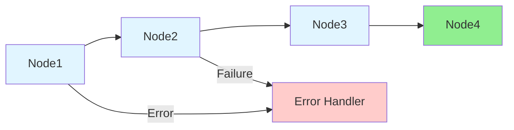

# [Adapter Name]

## Overview

[User supplied functional description]

## Architecture

### Purpose

[Detailed description of what problem this adapter solves and why it exists]

### Components

The adapter consists of [number] main message flow(s):

1. **[Flow Name 1]** - [Brief description]
2. **[Flow Name 2]** - [Brief description]

### Dependencies

- **[Library Name]** - [Purpose/functionality provided]
- **[Library Name]** - [Purpose/functionality provided]
- **[Library Name]** - [Purpose/functionality provided]


## Flow: [Flow Name]

### Purpose
[Detailed description of what this flow does]

### Flow Design



### Key Components

#### 1. [Node Name]

**Configuration:**
- [Property]: [Value]
- [Property]: [Value]

**Responsibilities:**
1. [Responsibility 1]
2. [Responsibility 2]

**Key Logic:**
```esql
[Code snippet if relevant]
```

**Error Handling:**
- [How errors are handled]
- [Retry behavior]
- [Logging approach]

#### 2. [Next Node Name]

[Repeat structure for each significant node]


## [Additional Sections as Needed]

### Database Schema (if applicable)

```sql
CREATE TABLE [TABLE_NAME] (
    [COLUMN] [TYPE] [CONSTRAINTS],
    ...
);
```

**Field Descriptions:**
- **[FIELD]**: [Description]

### REST API - Exposed Endpoints (if this application hosts a REST API)

> Only populate this section if an API spec file (`.yaml` / `.json`) or HTTP Input node is
> present in the provided files. Remove this section entirely if not applicable.

**Authentication:** [From API spec `securitySchemes` or ACE policy file - e.g. API Key, OAuth 2.0, Basic Auth, mTLS, None. Remove if not determinable from provided files.]

| Verb | Path | Description |
|------|------|-------------|
| [GET/POST/PUT/DELETE/PATCH] | [/path/from/spec] | [Description from spec] |

**Status Codes:**

> Only include codes explicitly defined in the API spec. Do not assume standard codes.
> Remove this subsection entirely if no API spec was provided.

| Code | Description |
|------|-------------|
| [code] | [Description from spec] |

---

### REST API - Consumed Endpoints (if this application calls a REST API)

> Only populate this section if an HTTP Request node or HTTP call-out is present. Remove this
> section entirely if not applicable.

**Authentication:** [From HTTP Request node properties, ACE policy file, or ESQL header setting - e.g. API Key header, Bearer token, Basic Auth. Remove if not determinable from provided files.]

| Verb | Path | Description |
|------|------|-------------|
| [GET/POST/PUT/DELETE/PATCH] | [/path/called] | [What this call does] |

**Status Codes Handled:**

> Only include codes explicitly handled in ESQL or defined in a provided API spec for the target
> system. Do not assume standard codes. Remove this subsection entirely if none are explicitly
> handled.

| Code | How the application handles it |
|------|-------------------------------|
| [code] | [ESQL branch / error path / retry logic] |

### MQ Configuration (if applicable)

```mqsc
DEFINE QLOCAL([QUEUE_NAME])
  DESCR('[Description]')
  MAXMSGL([size])
  DEFPSIST([YES/NO])
```

---

## Configuration

### Deployment Properties

[Read these from the deployment descriptors available]

| Property | TEST | PROD |
|----------|------|------|
| [property] | [value] | [value] |
| [property] | [value] | [value] |

**Important Notes:**
- [Any critical configuration notes]

---

## Logging Strategy

### Log Points

1. **[Log Point Name]** ([`filename.esql:line`](path/to/file.esql))
   - Type: [INFO/ERROR/WARN]
   - Status: [status-value]
   - Fields: [field1, field2, field3]

2. **[Next Log Point]**
   [Repeat structure]

### Elasticsearch Integration

- Enabled: [true/false]
- Prefix: `[prefix-value]`
- Integration: [How it integrates]

---

## Testing (only if a testing result overview is provided)

> Only populate this section if the user has supplied a test result overview, coverage report,
> or similar artefact. Document what IS tested - not what SHOULD be tested. Remove this section
> entirely if no test overview was provided. Do not invent recommendations; review-style gap
> analysis belongs in the `ace-review` skill, not in the README.

### Test Coverage

- **[Scenario / suite]** - [What is covered and the observed outcome]
- **[Scenario / suite]** - [What is covered and the observed outcome]

---

## Operational Considerations

### Monitoring

- **[What to watch]** - [Alert threshold or action]
- **[What to watch]** - [Alert threshold or action]

### Maintenance

- **[Maintenance task]** - [Frequency and procedure]
- **[Maintenance task]** - [Frequency and procedure]

### Dependencies and Integration Points

**Upstream systems:**
- **[System name]** - [What it provides / how it connects]

**Downstream systems:**
- **[System name]** - [What it receives / how it connects]

**Shared libraries:**
- **[Library name]** - [Purpose]

---

## Summary

[2-4 sentence factual recap: what the adapter does, the systems it integrates, the key
operational characteristics a reader should walk away with. This is a closing recap of the
documentation above - not a verdict, not a quality judgement, not a list of recommendations.
If a quality assessment is wanted, the `ace-review` skill is the right tool.]
