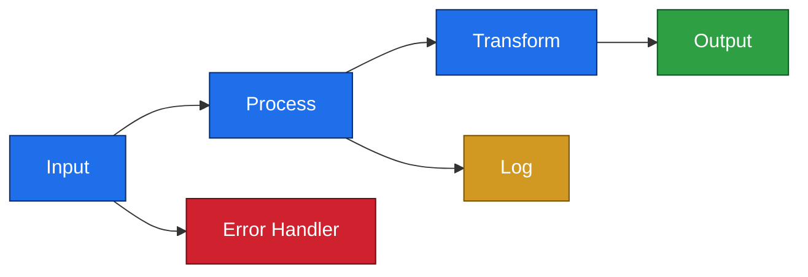

# [Adapter Name] - Technical Review

## Overview

[User supplied functional description]

## Architecture

### Purpose

[Detailed description of what problem this adapter solves and why it exists]

### Components

The adapter consists of [number] main message flow(s):

1. **[Flow Name 1]** - [Brief description]
2. **[Flow Name 2]** - [Brief description]

### Dependencies

- **[Library Name]** - [Purpose/functionality provided]
- **[Library Name]** - [Purpose/functionality provided]
- **[Library Name]** - [Purpose/functionality provided]

---

## Flow: [Flow Name]

### Purpose
[Detailed description of what this flow does]

### Flow Design



**Note:** Replace the above generic diagram with your actual flow structure. **Colour rules:** every `style` line must set `fill`, `stroke`, and `color` explicitly so the diagram is legible in both light and dark mode - never fill only. Keep the palette consistent and semantic across all diagrams (input / processing / output / error / log).

### Key Components

#### 1. [Node Name] ([`filename.msgflow:line`](path/to/file.msgflow))

**Configuration:**
- [Property]: [Value]
- [Property]: [Value]

**Responsibilities:**
1. [Responsibility 1]
2. [Responsibility 2]

**Key Logic:**
```esql
[Code snippet if relevant]
```

**Error Handling:**
- [How errors are handled]
- [Retry behavior]
- [Logging approach]

#### 2. [Next Node Name]

[Repeat structure for each significant node]

---

## [Additional Sections as Needed]

### Database Schema (if applicable)

```sql
CREATE TABLE [TABLE_NAME] (
    [COLUMN] [TYPE] [CONSTRAINTS],
    ...
);
```

**Field Descriptions:**
- **[FIELD]**: [Description]

### REST API Integration (if applicable)

**API Endpoints:**
1. **[METHOD] [PATH]** - [Description]

**Used Operation: [operationName]**

```yaml
[METHOD] [PATH]
Request Body:
  {
    "field": "type"
  }
Responses:
  [CODE]: [Description]
```

### MQ Configuration (if applicable)

```mqsc
DEFINE QLOCAL([QUEUE_NAME]) 
  DESCR('[Description]') 
  MAXMSGL([size])
  DEFPSIST([YES/NO])
```

---

## Configuration

### Deployment Properties

| Property | TEST | PROD |
|----------|------|------|
| [property] | [value] | [value] |
| [property] | [value] | [value] |

**Important Notes:**
- [Any critical configuration notes]

---

## Logging Strategy

### Log Points

1. **[Log Point Name]** ([`filename.esql:line`](path/to/file.esql))
   - Type: [INFO/ERROR/WARN]
   - Status: [status-value]
   - Fields: [field1, field2, field3]

2. **[Next Log Point]**
   [Repeat structure]

### Log Aggregation Integration (if any)

- Enabled: [true/false - or "none configured"]
- Prefix: `[prefix-value]`
- Integration: [How it integrates, e.g., ELK, Splunk, cloud logging]

---

## Strengths

1. **[Strength Category]**
   - [Specific strength]
   - [Specific strength]
   - [Why this is good]

2. **[Next Strength Category]**
   [Repeat structure]

---

## Areas for Improvement

Findings are grouped by topic (Security → Reliability → Performance → Flow Design → Coding → Configuration → Observability → Maintainability) and ordered by severity within each group.

Each finding uses a topic code + 2-digit counter as its ID:

| Code | Topic |
|------|-------|
| SEC-NN | Security |
| R-NN | Reliability / Error Handling |
| PERF-NN | Performance |
| FD-NN | Flow Design |
| C-NN | Coding (ESQL / Java) |
| CF-NN | Configuration |
| O-NN | Observability / Logging |
| M-NN | Maintainability |

---

### [TOPIC-NN] [Issue Title] [🔴/🟠/🟡/🟢]

**Issue:** [Description of the issue or limitation]

**Location:** [`filename.esql:42`](path/to/file.esql)

```esql
[Code snippet - scope to the specific function/procedure containing the issue, 5-15 lines]
```

**Recommendation:**
- [Specific recommendation]
- [Expected benefit]
- [Implementation consideration]

---

### [TOPIC-NN] [Next Issue] [🔴/🟠/🟡/🟢]

[Repeat structure for each finding]

---

## Findings Summary

| ID | Title | Severity | Location |
|----|-------|----------|----------|
| [TOPIC-NN] | [Issue Title] | 🔴 Critical | [`file.esql:42`](path/to/file.esql) |
| [TOPIC-NN] | [Issue Title] | 🟠 High | [`file.esql:55`](path/to/file.esql) |
| [TOPIC-NN] | [Issue Title] | 🟡 Medium | [`file.msgflow:12`](path/to/file.msgflow) |
| [TOPIC-NN] | [Issue Title] | 🟢 Low | [`file.esql:1`](path/to/file.esql) |

*One row per finding. Order: Critical → High → Medium → Low.*

---

## Remarks / Notes (non-findings)

Observations that are **not** rated findings - things that are correct at runtime or intentionally accepted, but worth recording. Omit this section if there is nothing to note.

- **Stale-but-overridden settings:** a node default differs from the deployment descriptor, but the descriptor correctly overrides it, so there is no runtime issue. Record as a remark, not a finding (see `workflow.md` - Cross-check promoted node properties).
- **Accepted deviations (per customer rules):** where `custom-rules/rules.md` allows a pattern this skill would otherwise flag, list each allowed item here with the rule that permits it - e.g. "Equal log prefixes across pillars - allowed per custom rule. Would normally be flagged as O-NN." Never silently drop an allowed item; surface it here so the deviation stays visible.
- **Coverage caveats:** anything that could not be verified - a skipped shared/schema library, a missing properties file, out-of-scope subflow internals.
- **Verified-correct, undocumented design choices:** a design decision the reviewer independently checked and confirmed is sound (e.g., an unconnected terminal that genuinely reaches an intentional error-handling framework), where the only gap is that nothing on the canvas or in the repo says so. Record what was verified and what closing the gap would look like - typically a sticky note (in-context, catches the next person who'd touch it) *and* a README update via `ace-readme` (durable, visible to anyone opening the repo, not just anyone opening that specific flow). Not a finding - do not score it.

---

## ACE Best Practices Compliance

### Alignment with IBM ACE Guidelines

#### ✅ Followed Best Practices

1. **[Practice Category]**
   - [Specific practice followed]
   - [Why this is good]
   - [ACE principle it aligns with]

#### ⚠️ Areas for Enhancement

1. **[Enhancement Area]**
   - Currently: [Current approach]
   - **Recommendation:** [Recommended approach]
   - Benefits: [Expected benefits]
   - Reference: [ACE Documentation Link]

---

## Testing Recommendations

### Unit Testing

1. **[Test Category]**
   - Test [scenario 1]
   - Test [scenario 2]
   - Test [scenario 3]

### Integration Testing

1. **[Integration Scenario]**
   - [Test steps]
   - [Expected outcome]
   - [Validation approach]

### Performance Testing

1. **[Performance Scenario]**
   - [Test approach]
   - [Metrics to monitor]
   - [Success criteria]

---

## Operational Considerations

### Monitoring

1. **[Monitoring Area]**
   - Monitor [metric]
   - Alert on [condition]
   - Dashboard: [what to display]

### Maintenance

1. **[Maintenance Area]**
   - [Maintenance task]
   - [Frequency]
   - [Procedure]

### Troubleshooting

1. **Common Issues**
   - Issue: [Description]
   - Cause: [Root cause]
   - Resolution: [How to fix]

2. **Diagnostic Queries/Commands**
```sql
-- [Description of what this query does]
[SQL query]
```

---

## Dependencies and Integration Points

### Upstream Systems
- **[System Name]** - [How it integrates]

### Downstream Systems
- **[System Name]** - [How it integrates]

### Shared Libraries
- **[Library Name]** - [Functionality provided]

---

## Conclusion

The [Adapter Name] is a [assessment of design quality] ACE application that [summary of what it accomplishes].

### Key Strengths
- [Strength 1]
- [Strength 2]
- [Strength 3]

### Priority Improvements

1. **High Priority - [Category]**
   - [Improvement 1]
   - [Improvement 2]

2. **Medium Priority - [Category]**
   - [Improvement 1]
   - [Improvement 2]

3. **Low Priority - [Category]**
   - [Improvement 1]
   - [Improvement 2]

**Overall Assessment:** [✅/⚠️/❌] [Production-Ready/Needs Work/Not Ready] with [Recommended/Required] Enhancements

**Use Case Fit:** [Assessment of how well the solution fits its intended purpose]

---

## Review Metadata

**Reviewed By:** [Name]  
**Review Date:** [Date]  
**ACE Version:** [Version]  
**Review Level:** [0/1/2/3]  
**Review Focus:** [File types actually reviewed, e.g., ESQL + Flow Design + Java]  
**Next Review:** [Date or trigger]
